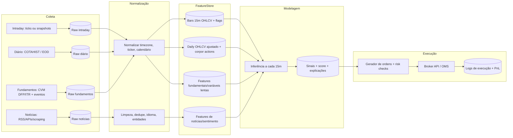

# Levantamento acionável para um sistema de trading intraday na B3 com automação e IA

## Resumo executivo

Você já tem um embrião funcional de ingestão de dados no repositório **sisacao-8**, com duas rotas principais: (a) coleta de preço “intraday” por scraping do Google Finance (Cloud Run) e escrita no BigQuery; (b) coleta diária de fechamento via arquivo oficial “COTAHIST_D” (B3) e escrita no BigQuery. Isso é um bom ponto de partida para **automação máxima** (serverless + BigQuery), mas há riscos relevantes de robustez e aderência ao objetivo de trading (6–8% de take-profit intraday). citeturn6view1turn13view0turn34view0

Para transformar isso em um sistema realista e operacional (pesquisa → backtest → paper → produção), os maiores “gargalos” são:

- **Fonte intraday confiável**: scraping (Google Finance/Yahoo) tende a falhar/variar, e não te dá garantias de latência/qualidade. Para operar intraday com consistência, você normalmente precisará de **market data licenciado** (via distribuidor B3) ou de um provedor pago com API/WebSocket e regras claras de uso/licença (ex.: Market Data Cloud/Cedro; ou uma API brasileira intermediária como brapi). citeturn20view2turn20view1turn20view0turn32search0  
- **Label/target adequado** ao take-profit (6–8%) com dados de 15 minutos: se o seu alvo é “bater +6%/+8%” dentro de uma janela curta, você precisa de um target que use **máxima/mínima futura (high/low)** e uma regra explícita de “hit” (take-profit antes de stop-loss e antes do tempo expirar). Isso impacta diretamente classes desbalanceadas, frequência de trades e viés de backtest.  
- **Backtesting e validação robustos**: em finanças, CV aleatória é incorreta, e validação precisa respeitar tempo (walk-forward/TimeSeriesSplit e, quando aplicável, abordagens com purga/embargo para mitigar vazamento). citeturn39search1turn39search2  
- **Observabilidade/monitoramento**: sem monitoramento de latência de ingestão, falhas silenciosas e drift, o sistema degrada sem você perceber.  
- **Compliance e licenças**: (a) uso e redistribuição de market data da B3 têm regras contratuais (real-time x delayed; “non-display” etc.); (b) se você publicar recomendações/relatórios a terceiros ou operar dinheiro de terceiros, entram requisitos de registro/credenciamento na CVM (não é consultoria legal; é um “checklist de pontos sensíveis”). citeturn23view1turn20view2turn27view2turn27view3  

## Avaliação do repositório e lacunas para produção

O repositório implementa uma arquitetura simples e eficiente em GCP:

- **Ingestão intraday**: uma função Cloud Run (“google_finance_price”) busca o preço no Google Finance via HTTP, extrai o preço do HTML (com fallback para endpoint interno batchexecute) e grava no BigQuery no dataset `cotacao_intraday`, tabela `cotacao_b3`, com campos como `ticker`, `data`, `hora`, `valor`, `hora_atual`, `data_hora_atual`. citeturn13view0turn15view0  
- **Ingestão diária**: a função `get_stock_data` baixa o arquivo oficial diário `COTAHIST_DDDMMAAAA.ZIP` no endpoint `InstDados/SerHist/`, lê o TXT (layout fixo) e extrai o **preço de fechamento** por ticker (`linha[108:121]/100`). Em seguida grava no BigQuery em `cotacao_intraday.candles_diarios` com esquema explícito (`ticker`, `data_pregao`, `preco_fechamento`, `data_captura`, `fonte`). citeturn34view0  
- **Calendário de feriados**: há um script SQL para criar e alimentar uma tabela `feriados_b3` usada para bloquear coletas em dias sem pregão. citeturn14view2  
- **Dependências**: já contempla pandas/pyarrow e BigQuery; e cita TensorFlow CPU no requirements do projeto (sinal de intenção de ML). citeturn8view0  

Lacunas principais (de forma objetiva e acionável):

- **Qualidade/robustez do intraday**: scraping é frágil por definição (mudanças em HTML, bloqueio, rate-limit). O seu próprio scraper já implementa múltiplos fallbacks, sinal claro de instabilidade esperada. citeturn15view0  
- **Modelo de dados intraday insuficiente**: armazenar apenas `valor` por timestamp não preserva OHLCV de barras de 15 minutos (nem *high/low* intrabar), o que é essencial para targets como “bateu +6%?” com base em máximas/mínimas, e para simular execução realista.  
- **Aderência à regra de mercado**: pregão, pré-abertura, call de fechamento e janelas especiais mudam e devem ser refletidos na geração de candles. A B3 publicou grades horárias (ex.: 03/11/2025 em diante) com **pré-abertura 09:45–10:00; negociação até 17:55; call de fechamento 17:55–18:00** para mercado à vista (com fase de cancelamento etc.). citeturn31view1turn30view0  
- **Camada de execução**: corretora/API de ordens não definida. Isso é ok neste estágio, mas você deve projetar o sistema para “plugar” execução (DMA/roteamento) depois.  

## Fontes de dados para B3, notícias e fundamentos

### Tabela comparativa de fontes

A tabela abaixo prioriza fontes com **API**, com observações pragmáticas sobre latência, limites e licenças.

| Fonte | Tipo | Custo | Latência / atualização | Cobertura B3 | API disponível | Observações |
|---|---|---:|---|---|---|---|
| Arquivo oficial **COTAHIST** (B3) | Diário (EOD) | Gratuito | EOD | Alta (histórico amplo) | Download HTTP (arquivo) | Layout fixo com posições de campos (ex.: PREULT 109–121, TOTNEG etc.). Ideal para base histórica e ajustes. citeturn24view1turn24view2turn19search32 |
| **Market Data B3** via distribuidores (UMDF, etc.) | Intraday (real-time/15min), book | Sob contrato | Real-time (<15 min) ou Delayed (≥15 min) | Máxima | Sim (via distribuidor) | Políticas definem “REAL TIME” (<15 min) e “DELAYED” (≥15 min) e classificações como “non-display”. Relevante para compliance e licenças. citeturn20view2turn23view1 |
| entity["company","Market Data Cloud","brasil market data api"] (planos PF) | Intraday + diário + notícias | R$ 439,90/mês (anual) a R$ 1.033,50/mês (mensal) | WebSocket / ticks | Alta | REST + WebSocket | Traz “Quotes”, “TICKS”, “Notícias B3”, “Candles 1 min”, “Book L2”, “Proventos” etc. Planos PF limitados a uso próprio e sujeitos a auditoria. citeturn20view0 |
| entity["company","brapi.dev","brazil market data api"] | Quotes/histórico + fundamentos | Gratuito e pago (ex.: Pro R$ 83,33/mês anual) | 5 a 30 min (por plano) | Alta (400+ ativos) | REST | Página de pricing define limites mensais e frequência (ex.: Pro “a cada 5 min”; Free “a cada 30 min”). Útil para prototipar e até produção de baixa/média criticidade. citeturn32search0turn32search4turn32search2turn32search24 |
| entity["company","Dados de Mercado","brasil financial data api"] | Bolsa + empresas + docs + notícias | Não explicitado publicamente | Não explicitado | Brasil (foco local) | REST (token) | Documentação descreve endpoints (cotações, empresas, docs CVM etc.) com autenticação por token. citeturn33search1turn33search13 |
| yfinance / Yahoo Finance | Intraday + diário | Gratuito | Sem SLA | Média/Alta (tickers .SA) | Via biblioteca | Limitação estrutural: intraday (<1d) só até ~60 dias, e 1m até ~7 dias (bom para P&D, fraco para produção). citeturn16search1turn16search25 |
| Google Finance (scraping) | Intraday (snapshot) | Gratuito | Sem SLA | Média | Não oficial | O seu código faz scraping + fallback batchexecute. Útil como fallback, mas instável para produção e com risco de bloqueio/termos. citeturn15view0turn13view0 |
| entity["company","Alpha Vantage","market data api"] | Intraday (1–60min) e diário | Free + premium | Depende do plano | Incerto p/ B3 | REST | Limite free citado pelo próprio fornecedor: 25 req/dia; premium a partir de $49,99/mês (75 req/min). Verificar se atende tickers B3 desejados. citeturn17view0turn17view1 |
| EODHD | Diário + intraday | €19,99+/mês | Depende do plano | Provável (global) | REST | Pricing público com planos; útil para histórico e uniformização multi-mercado, mas precisa confirmar qualidade B3 intraday. citeturn16search2 |
| entity["organization","CVM","brazil securities regulator"] Dados Abertos (DFP/ITR) | Fundamentais (balanços) | Gratuito | Atualização semanal | Empresas listadas | CKAN + ZIPs | DFP/ITR trazem demonstrações (BPA/BPP/DRE/DFC/DMPL/DVA etc.) e links de download; datasets atualizados semanalmente. citeturn25view1turn25view2turn25view3 |
| CVM Download Múltiplo (RAD) | Documentos (IPE/ITR/DFP etc.) | Acesso controlado | Por demanda | Alta | POST + XML (login) | Manual técnico descreve endpoint e resposta XML para baixar documentos por janela de tempo (≤24h), com login/senha. citeturn25view0 |
| entity["organization","GDELT Project","global news dataset"] | Notícias (global, multilíngue) | Gratuito | Atualizações frequentes (ex.: Event DB a cada 15 min) | Indireta | API/arquivos | Base mundial para notícias/eventos; útil para macro, risco e “trend” de atenção, incluindo pt. citeturn36search4turn36search0turn36search16 |
| entity["company","NewsAPI","news api provider"] | Notícias (agregador) | Dev $0; Business $449/mês | Dev: atraso 24h | Indireta | REST | Plano Developer gratuito, mas com atraso (24h) e 100 req/dia; Business pago. citeturn36search1 |
| entity["company","Event Registry","news intelligence api"] (newsapi.ai) | Notícias (agregador) | A partir de $90/mês | Near real-time (por plano) | Indireta | REST | Página de planos do provedor indica planos pagos (ex.: “5K Plan $90/mês”). citeturn36search5turn36search3 |
| entity["company","Microsoft","bing and azure"] Bing News Search (Azure) | Notícias (agregador) | Pay-per-transaction | Baixa latência | Indireta | REST | Pricing por transação; bundles incluem Bing News Search; termos e preços variam por instância/região. citeturn36search2turn36search34 |

### Latência e frequência: o que é “aceitável” para candles de 15 minutos

Para operação baseada em candles de 15m, o requisito mínimo costuma ser: **candle fechado disponível com atraso de segundos a poucos minutos**, de forma consistente. Caso você opere “rompimentos” e precise reagir logo após o fechamento, atrasos de 2–5 minutos podem destruir o edge (isso é uma inferência prática, não um fato garantido — vale medir na prática por ativo e fonte).

A B3 define “real time” como distribuição com menos de 15 minutos, e “delayed” a partir de 15 minutos. Então, se você só pode contratar delayed, seu modelo precisa assumir que está operando “com atraso”, o que muda completamente o backtest. citeturn20view2

## Arquitetura de coleta, armazenamento e normalização

### Arquitetura recomendada (batch + near-real-time), alinhada ao que você já tem

Você já está no caminho de **GCP serverless + BigQuery**. A evolução natural é separar: *raw ingest* → *normalização* → *feature store* → *signals* → *execução*.



### Modelo de dados: tabelas mínimas (BigQuery) para não te travar depois

Abaixo um esquema mínimo (pensado para 15m + diário + execução). A ideia é ter chaves claras e permitir qualidade/auditoria.

**Bars 15m (`bars_15m`)**  
Chave: `(ticker, ts_end, source)`  
Campos: `ts_start`, `ts_end`, `open`, `high`, `low`, `close`, `volume`, `vwap` (se houver), `trade_count` (se houver), `source`, `ingested_at`, `quality_flags` (bitmask) e `missing_reason`.

**Ticks (`ticks`)** (se você contratar/prover ticks)  
Chave: `(ticker, ts, source, seq)`  
Campos: `price`, `size`, `side` (se disponível), `best_bid`, `best_ask` (se disponível), `ingested_at`.

**Daily (`eod_daily`)**  
Chave: `(ticker, date, source)`  
Campos: OHLCV, `adj_factor`, `dividend`, `split`, etc.

**Corporate actions (`corporate_actions`)**  
Chave: `(ticker, event_date, event_type, source)`  
Campos conforme evento: dividendos/JCP (valor, data ex, data pagamento), splits, grupamentos etc.

**News (`news_raw` / `news_features`)**  
`news_raw`: texto/HTML limpo, fonte (domínio), timestamp, idioma, hash para dedupe.  
`news_features`: entidades, sentimento, relevância, categoria, confiança, *source_score*.

**Executions (`orders`, `fills`)**  
- `orders`: timestamp, ticker, side, qty, order_type, limit_price, strategy_id, model_version  
- `fills`: fill_ts, fill_price, fill_qty, fees_estimated, slippage_estimated, venue

### Normalização e tratamento de dados faltantes (missing)

1) **Calendário e horários**: gere candles de 15m respeitando as fases (pré-abertura, negociação, call de fechamento). A B3 publicou a grade (ex.: pré-abertura 09:45–10:00, negociação 10:00–17:55, call 17:55–18:00 para mercado à vista). citeturn31view1turn30view1  

2) **Timezone**: padronize tudo para `America/Sao_Paulo` no armazenamento lógico (ou armazene em UTC e derive o local). Seu projeto já trata timezone e datas de captura em BigQuery. citeturn34view0turn13view0turn14view2  

3) **Missing intraday**:  
- Não “inventar” OHLCV. Se um candle está faltando, grave o candle como ausente (ou não grave e gere posteriormente a grade completa com *left join*), mas **sempre gere um `missing_flag`**.  
- Para features que exigem continuidade (ex.: retornos), use `masking`/flags ou imputação controlada (ex.: forward-fill apenas para variáveis lentas como fundamentos; nunca para preço intraday).  

4) **Fusão multi-fonte** (prioridade e auditoria): defina um ranking por qualidade e latência, por exemplo:  
- intraday_provedor_pago (primário) → brapi (secundário) → scraping (fallback)  
Grave sempre `source` e compare divergência (ex.: diferença percentual > X gera alerta e impede trade naquele candle).

### Observação crítica sobre o layout COTAHIST (B3)

O layout do arquivo de cotações históricas tem posições fixas e inclui campos essenciais para você (preço de abertura, máxima, mínima, último, número de negócios, quantidade, volume). Exemplos úteis: `PREABE` (abertura), `PREMAX` (máxima), `PREMIN` (mínima), `PREULT` (último), `TOTNEG` (número de negócios), `QUATOT` e `VOLTOT`. citeturn24view1turn24view2  

Seu código diário já extrai fechamento via `linha[108:121]`, consistente com a posição do `PREULT` no layout. citeturn34view0turn24view1

## Engenharia de features e targets para 15 minutos e diário

### Features recomendadas para 15 minutos

Uma abordagem prática (e muito usada em intraday) é **feature engineering forte + modelos tabulares** (GBDT) como baseline, e só depois migrar para redes (LSTM/TCN/Transformer) quando você tiver volume e qualidade de dados suficientes.

Conjunto de features “mínimo” para começar:

- **Retornos e candle anatomy**:  
  - `ret_1 = log(close/close[-1])`  
  - `range = (high-low)/close`  
  - `body = (close-open)/open`  
  - `upper_wick`, `lower_wick` normalizados  
- **Volatilidade intraday**: ATR (em 15m), volatilidade realizada (janela de 1–3 dias em barras), *vol z-score*.  
- **Tendência e mean reversion**: EMA(9/21/50), inclinação de EMA, MACD, RSI(14), Bollinger z-score, Stochastic, ADX.  
- **Volume e pressão** (se tiver volume):  
  - `volume_z`, `volume_change`, `price*volume` (proxy de fluxo)  
  - OBV, MFI (se volume confiável)  
- **Sazonalidade intraday**:  
  - minuto do dia, bloco (manhã/meio/fim), proximidade do call de fechamento; dummies para primeira/última hora.  
- **Liquidez (proxy)**: `spread` e `book_imbalance` **se** você contratar L1/L2. Caso não tenha, use proxies (volatilidade + volume).  

Se você usar uma fonte que só dá “último preço” (como seu scraping atual), dificilmente terá volume/low/high — o que limita fortemente o conjunto de features e a confiabilidade do target.

### Features recomendadas para diário

O diário pode funcionar como “contexto” para o intraday:

- **Tendência de maior prazo**: retornos 5/20/60/120/252 dias; MA/EMA 20/50/200 e inclinações.  
- **Risco**: ATR diário, volatilidade 20/60 dias.  
- **Regime**: indicadores simples de regime (ex.: volatilidade alta vs baixa) usados como feature categórica.  
- **Fundamentos (variáveis lentas)**: crescimento de receita/lucro, endividamento, margem, ROE etc. (atualizados trimestralmente) — útil para filtrar universo e ajustar o comportamento do modelo por “tipo” de ativo. citeturn25view1turn25view2  

### Target engineering para take-profit 6–8% em intraday

O seu objetivo (“alvo de lucro por trade entre 6% e 8%”) precisa virar um target que:

1) use **high/low futuros** para detectar se o preço teria encostado no take-profit;  
2) respeite uma **janela temporal** máxima (ex.: até o final do pregão, ou próximas N barras);  
3) considere um **stop-loss** (sem isso, o backtest tende a “superestimar” trades).

**Opção A — classificação por “hit” de take-profit (recomendado como primeiro alvo)**  
Defina, a cada candle t (com preço de entrada = `close_t` ou `open_{t+1}`), um horizonte H (ex.: próximos 8 candles = 2h, ou até o fim do dia). Crie:

- `tp = +6%` (ou +8%)  
- `sl = -x%` (ex.: -2% a -4% – escolha pragmática; sem isso o risco explode)  
- Label:
  - `+1` se `max(high_{t+1..t+H}) >= entry*(1+tp)` **antes** de `min(low_{t+1..t+H}) <= entry*(1-sl)`  
  - `0` caso contrário (ou `-1` se bater stop primeiro; em 3 classes)

Isso exige high/low intrabar. Sem isso, o target fica frágil.

**Opção B — regressão de “melhor retorno futuro” (útil para ranking)**  
Target contínuo:
- `y = max( (high_{t+1..t+H}/entry) - 1 )`  
Depois, em produção, você compra quando `P(y >= 0.06)` for alta (classificador) ou quando `ŷ` for alto (regressor), sempre com filtros de risco.

**Problema realista a considerar (inferência)**: +6%/+8% em horizontes curtos tende a gerar **poucos positivos** (classe rara) em ações líquidas; isso força técnicas de balanceamento, ou muda o universo (ativos mais voláteis/menos líquidos), o que aumenta slippage e risco de execução.

## Modelagem, validação e pipelines de treino e inferência

### Comparativo de modelos (visão prática para 15m + diário)

| Modelo | Vantagens | Desvantagens | Custo computacional | Latência típica | Quando usar |
|---|---|---|---|---|---|
| Regressão logística / Linear | Baseline forte, interpretável, rápido | Limita não-linearidades | Baixíssimo | ms | Primeiro baseline para “hit TP” (classificação) e sanity check |
| entity["organization","XGBoost","gradient boosting library"] (GBDT) | Excelente em dados tabulares, lida bem com não-linearidade, robusto | Pode overfit sem cuidado temporal; exige feature engineering | Baixo–médio | ms–dezenas ms | **Modelo principal** recomendado para início em intraday citeturn39search0turn39search4 |
| LightGBM (GBDT) | Muito eficiente e rápido | Idem GBDT; tuning | Baixo–médio | ms–dezenas ms | Similar a XGBoost; ótimo quando escala cresce citeturn39search3turn39search7 |
| Random Forest | Bom baseline não-linear | Pior que GBDT em muitos problemas; pesado | Médio | ms–100ms | Baseline adicional; importância de features |
| LSTM/GRU | Captura dependência temporal em sequência | Precisa muito dado limpo; tuning; risco overfit | Médio–alto (treino) | ms–10s ms | Depois do baseline tabular; bom se você tiver OHLCV e sequência longa citeturn35search0turn35search20 |
| TCN | Paralelizável, competitivo vs RNN | Arquitetura/tuning; precisa dados | Médio–alto | ms–10s ms | Alternativa a RNN para sequência; costuma treinar bem citeturn35search2 |
| Transformer (encoder) | Excelente para dependências longas e multimodais | Custo alto; precisa dados; tuning | Alto | ms–100ms (inferência) | Quando você tiver massa de dados e quiser integrar múltiplas fontes citeturn35search1turn35search13 |
| TFT (Temporal Fusion Transformer) | Multi-horizon + interpretabilidade | Complexo; tuning; custo | Alto | variável | Quando você quiser previsão multi-horizonte e interpretação de variáveis citeturn35search3turn35search7 |

### Validação robusta: como evitar vazamento temporal

- **Separação temporal obrigatória**: use splits baseados no tempo, nunca K-fold aleatório. O `TimeSeriesSplit` do scikit-learn existe justamente porque CV tradicional “treina no futuro e testa no passado”. citeturn39search1  
- **Walk-forward (expanding/rolling)**: valide em janelas sequenciais (ex.: treina 6 meses → testa 1 mês; avança 1 mês).  
- **Purga/embargo quando houver “overlap”**: em alvos com horizonte H, parte do treino pode vazar informação para o teste porque os rótulos usam futuro. Uma referência clássica do mercado para isso é a discussão de purged k-fold/embargo em finanças. citeturn39search2  
- **Features e scalers**: todo fit (Scaler, PCA, imputação) deve ser feito **apenas no treino** e aplicado no teste.  
- **Avaliação por regime**: além da métrica agregada, avalie por regime (volatilidade alta/baixa; tendência/flat).  

Métricas recomendadas (além de AUC/accuracy):  
- *Precision/recall* na classe “hit TP” (positivos raros), *calibration* (Brier score), e métricas de trading (expectância, profit factor, drawdown).

### Pipeline de produção: batch vs streaming

Para candles de 15m, o desenho mais simples e robusto é **near-real-time em batch**:

- **Agendador**: executa a cada 1–5 minutos, e fecha candles a cada 15 minutos.  
- **Ingestão**: puxa ticks (WebSocket) ou snapshots (REST) e agrega para OHLCV.  
- **Inferência**: roda logo após fechar o candle (idealmente em <1–5s para um universo moderado).  
- **Geração de ordem**: se sinal > limiar e risk checks ok, envia ordem.

Streaming “de verdade” (tick-by-tick) só faz sentido se:
- você tiver feed confiável de ticks/book;  
- o edge depender de microestrutura;  
- você aceitar complexidade infra (stateful streaming).

### Requisitos de infraestrutura e latência

**Infra mínima (para seu caso, 15m):**
- 1 banco/warehouse (BigQuery já serve).
- 1 camada de compute para agregação e inferência (Cloud Run ou VM pequena).
- 1 orquestrador leve (Cloud Scheduler + Cloud Run; ou Prefect/Dagster/Airflow se crescer).
- Logs + métricas.

**Latência aceitável (heurística)**:
- Dados: ideal < 60s após candle fechar (medir por fonte).  
- Inferência: < 1s por ativo (com XGBoost/LightGBM) ou poucos segundos para universo inteiro.  
- Execução: depende da corretora e do tipo de ordem; seu backtest precisa modelar esse atraso.

## Notícias, sentimento com OpenAI e verificação de fontes

### Fontes confiáveis em pt-BR e ingestão (scraping vs API)

Em pt-BR, grande parte do conteúdo premium (Valor, alguns conteúdos Estadão etc.) tem paywall e termos restritivos. Para automação, você tende a usar:

- **Agregadores com API** (mais estável): NewsAPI, Event Registry, Bing News. citeturn36search1turn36search5turn36search2  
- **Fontes públicas oficiais** (para “verdade de eventos”): documentos CVM (IPE, fatos relevantes, comunicados) e eventos/avisos corporativos; isso reduz risco de fake news. CVM também oferece datasets e mecanismos de download em massa. citeturn25view0turn25view1  
- **GDELT**: útil como “termômetro” global e para detectar explosões de cobertura, inclusive em português. citeturn36search4turn36search0  

Regra prática: para trade, **notícia sozinha** raramente é sinal suficiente; melhor tratar como feature (contexto) + filtro de risco.

### Pipeline de IA para notícias e sentimento

1) **Coleta**: título + corpo + fonte + timestamp.  
2) **Limpeza e deduplicação**: normalize HTML, remova boilerplate, compute hash (simhash).  
3) **Detecção de idioma** e **roteamento** (pt-BR vs en).  
4) **Extração de entidades**: tickers, nomes das empresas, “CVM/IPE”, órgãos públicos, executivos.  
5) **Classificação**:
   - Sentimento (bullish/bearish/neutral) **e** direção (impacto provável no preço): `impact = +1/0/-1`.  
   - Relevância para o universo (0–1).  
   - Tipo de evento: resultado, M&A, regulação, guia/earnings, dividendos, greve/acidente, etc.  
6) **Score de confiabilidade**:
   - whitelist de domínios, reputação histórica, presença de confirmação em fonte oficial.  
7) **Publicação**: grava `news_features` e alimenta o modelo (ou um “news risk gate”).

### Prompts e exemplo de chamada na API da OpenAI (pt-BR)

Você pode usar a **Responses API** com **Structured Outputs** (JSON Schema com `strict=true`) para produzir saída 100% parseável. O guia oficial descreve que Structured Outputs garante aderência ao schema e mostra como passar `response_format` com `type: "json_schema"`. citeturn37view0turn38view0turn37view2  

> Observação: o guia também aponta compatibilidade por snapshots/modelos; você deve validar qual modelo atende `json_schema` no seu ambiente e custo. citeturn38view1turn18search2  

**Prompt (system) — classificador de notícia para trading (pt-BR)**  
Objetivo: extrair tickers, classificar impacto e dar um score.

**Exemplo de schema (resumo)**
- `tickers`: lista de strings
- `evento`: enum
- `impacto`: enum { "positivo", "negativo", "neutro" }
- `confianca_impacto`: 0–1
- `relevancia`: 0–1
- `resumo`: string curta
- `recomendacao_operacional`: enum { "usar_com_feature", "acionar_risk_gate", "ignorar" }
- `riscos_de_fake_news`: lista de strings

```python
from openai import OpenAI

client = OpenAI()

schema = {
  "name": "news_signal_ptbr",
  "schema": {
    "type": "object",
    "additionalProperties": False,
    "properties": {
      "tickers": {"type": "array", "items": {"type": "string"}},
      "evento": {
        "type": "string",
        "enum": ["resultado", "fato_relevante", "provento", "m&a", "regulacao", "macro", "acidente", "outro"]
      },
      "impacto": {"type": "string", "enum": ["positivo", "negativo", "neutro"]},
      "confianca_impacto": {"type": "number", "minimum": 0, "maximum": 1},
      "relevancia": {"type": "number", "minimum": 0, "maximum": 1},
      "resumo": {"type": "string"},
      "recomendacao_operacional": {
        "type": "string",
        "enum": ["usar_com_feature", "acionar_risk_gate", "ignorar"]
      },
      "riscos_de_fake_news": {"type": "array", "items": {"type": "string"}}
    },
    "required": ["tickers", "evento", "impacto", "confianca_impacto", "relevancia", "resumo", "recomendacao_operacional", "riscos_de_fake_news"]
  },
  "strict": True
}

texto_noticia = """
TÍTULO: ... 
FONTE: ...
DATA/HORA: ...
TEXTO: ...
"""

resp = client.responses.create(
  model="gpt-4o-2024-08-06",
  input=[
    {"role": "system", "content": "Você é um analista de notícias para trading. Extraia tickers, classifique o evento e estime impacto de curto prazo (intraday). Seja conservador: se faltar informação, marque 'neutro' e reduza confiança."},
    {"role": "user", "content": texto_noticia},
  ],
  response_format={"type": "json_schema", "json_schema": schema}
)

print(resp.output_text)
```

Esse estilo de chamada (Responses API via SDK Python) segue o quickstart. citeturn37view2turn37view1  

**Proteções recomendadas (conteúdo e risco)**
- Use o endpoint de **Moderação** para filtrar entradas suspeitas/abusivas antes de processar (a documentação indica que o endpoint de moderação é gratuito e serve para detectar conteúdo potencialmente nocivo). citeturn18search3turn18search23  
- Controle custo com modelos e tokenização: a página oficial de pricing traz valores por 1M tokens (varia por modelo). citeturn18search2turn18search6  

### Como lidar com fake news e verificação de fontes

Uma abordagem prática (para reduzir trades por “boato”):

- **Whitelist** (alto peso): fontes oficiais (CVM/IPE, comunicados de RI, documentos registrados) e grandes veículos com histórico.  
- **Cross-check automático**: quando notícia for “impacto alto” e “confianca_impacto alta”, exigir segunda confirmação:
  - match por ticker + assunto em base de documentos “oficiais” (ex.: CVM download múltiplo ou endpoints de documentos de agregadores que linkam CVM). citeturn25view0turn33search13  
- **Score de confiabilidade** por domínio e por padrão textual:
  - domínio recém-criado, texto sem fonte primária, uso de linguagem sensacionalista → “acionar_risk_gate”.  
- **Human-in-the-loop**: em casos raros (sinal grande), peça aprovação manual via alerta (Slack/Telegram/email).

## Backtesting realista, risco, governança e compliance

### Backtesting e simulação: o que não pode faltar

**Execução e slippage**
- Modele o fill com base em OHLC intrabar:  
  - ordem a mercado: preço = `open_{t+1}` + slippage  
  - ordem limite: executa se `low/high` cruzar o limite; e ainda assim, inclua chance de “não preencher” em baixa liquidez.  
- Se tiver L1/L2 (book), use spread real e profundidade como slippage paramétrico.

**Custos e impostos (Brasil)**
- Dedução de corretagem/taxas: a Receita Federal explica que despesas efetivamente pagas podem ser incorporadas ao custo de compra/venda para apurar ganho líquido, e que há retenções na fonte em operações comuns e day trade (alíquotas pequenas) feitas pela corretora. citeturn27view0  
- Day trade: conteúdo educativo da B3 indica tributação de 20% sobre lucro e obrigação de informar operações; também discute pagamento mensal via DARF. citeturn28view0  
- Referências práticas de mercado citam IRRF “dedo-duro” e alíquotas (ex.: 1% sobre lucro no day trade) — isso deve ser conferido com sua corretora/contabilidade, pois não é consultoria legal. citeturn28view2turn28view1  

**Risco por trade e limites**
- Defina regras ex ante:  
  - risco máximo por trade (ex.: 0,25%–1% do capital)  
  - limite de perda diária (“daily stop”)  
  - limite de exposição simultânea (n ativos)  
  - filtro de liquidez mínima (volume médio e spread)  

**Métricas**
- Além de Sharpe/Sortino e retorno:  
  - max drawdown, time-to-recover, profit factor, expectancy, hit rate  
  - número de trades e concentração por ativo/dia  
  - sensibilidade a custos (stress test +50% custos/slippage)

### Governança, monitoramento e alertas

Instrumente o sistema desde o início com:

- **Data quality**: atraso (lag) de ingestão por fonte, missing candles, divergência entre fontes.  
- **Model drift**: distribuição de features (PSI/KS), queda de calibration e AUC.  
- **Trading KPIs**: P&L diário, drawdown, taxa de erro de execução, ordens rejeitadas.  
- **Alertas**: thresholds e “circuit breaker” (se fonte principal falha → não operar; se divergência > X → bloquear).

### Compliance e pontos regulatórios (sem consultoria legal)

Checklist objetivo de “onde dá problema”:

- **Licença de market data**: a política comercial da B3 define real time vs delayed e aspectos de distribuição/uso (incluindo usos “non-display”). Se você pretende exibir dados a terceiros ou redistribuir, isso tende a exigir contratos específicos. citeturn20view2turn23view1  
- **Planos PF x uso comercial**: provedores intermediários podem limitar “uso próprio PF” e mencionar auditoria; isso afeta se você transformar em produto/serviço. citeturn20view0  
- **Atividade profissional regulada**:  
  - consultoria de valores mobiliários exige credenciamento/registro (CVM). citeturn27view2turn26search16  
  - analista que publica/distribui relatórios a terceiros tem regras de credenciamento. citeturn27view3  
  - administração/gestão de carteira de terceiros exige autorização prévia. citeturn27view1  

Se o sistema for estritamente para **uso próprio**, muitos desses itens reduzem, mas não desaparecem (ex.: licença de dados e termos de uso do provedor; obrigações fiscais).

## Roadmap em sprints e riscos principais

### Roadmap sugerido (sprints de 2 semanas)

```mermaid
gantt
  title Roadmap em sprints para trading intraday (B3)
  dateFormat  YYYY-MM-DD
  excludes    weekends

  section Fundamentos do sistema
  Sprint 1: Auditoria do repositório + modelo de dados alvo (bars_15m, daily, exec) :a1, 2026-02-17, 14d
  Sprint 2: Ingestão intraday robusta (provedor/API) + geração de OHLCV 15m + QA :a2, after a1, 14d

  section Pesquisa e backtest
  Sprint 3: Backtest engine (fills, slippage, custos, impostos) + baseline (logreg/GBDT) :b1, after a2, 14d
  Sprint 4: Validação walk-forward + tuning + feature importance + stress tests :b2, after b1, 14d

  section Notícias e fundamentos
  Sprint 5: Pipeline de notícias + entidades + sentimento (OpenAI) + risk gate :c1, after b2, 14d
  Sprint 6: Fundamentos CVM (DFP/ITR) + eventos corporativos + features lentas :c2, after c1, 14d

  section Produção controlada
  Sprint 7: Inferência em produção + monitoramento (drift, latência, PnL) + paper trading :d1, after c2, 14d
  Sprint 8: Integração com corretora/execução + controles de risco + rollout gradual :d2, after d1, 14d
```

### Entregáveis por sprint (direto ao ponto)

- **Sprint 1**:  
  - congelar contrato de schema e chaves;  
  - implantar tabelas BigQuery particionadas/clusterizadas;  
  - definir “universo” inicial (ex.: top 50–100 por liquidez).  
- **Sprint 2**:  
  - trocar/acompanhar fonte intraday por provider com API;  
  - gerar `bars_15m` com *high/low/volume*;  
  - QA: missing, atrasos, dedupe, reconciliação.  
- **Sprint 3–4**:  
  - backtester com execução realista;  
  - baseline GBDT;  
  - walk-forward e relatórios (drawdown, robustez a custos). citeturn39search1turn39search0  
- **Sprint 5–6**:  
  - notícias com OpenAI + schema JSON estrito;  
  - fundamentos via DFP/ITR; união com universe. citeturn37view0turn25view1turn25view2  
- **Sprint 7–8**:  
  - pipeline produção + monitoramento;  
  - paper trading;  
  - integração execução e rollout.

### Riscos principais e mitigação

- **Risco de alvo irrealista (6–8% intraday)**: pode levar a poucos sinais, overfitting e “doping” de backtest. Mitigação: medir taxa de hits por ativo, considerar targets escalonados (ex.: 2%, 4%, 6%) e tratar como ranking/probabilidade.  
- **Fonte intraday frágil**: scraping quebra e gera falsos sinais. Mitigação: provider pago + fallback + bloqueio automático quando qualidade cair. citeturn15view0turn20view0  
- **Licença/redistribuição**: virar produto exige contrato e pode mudar sua arquitetura. Mitigação: decidir cedo se é “uso próprio” ou “produto”. citeturn20view2turn20view0  
- **Vazamento temporal**: validação errada “inventa edge”. Mitigação: TimeSeriesSplit/walk-forward e (quando necessário) purga/embargo. citeturn39search1turn39search2  

### Stack e bibliotecas recomendadas (Python)

- Dados: `pandas`, `numpy`, `pyarrow`, `requests` (você já usa) citeturn8view0turn14view1  
- Indicadores: `ta-lib` ou `ta`  
- Modelos: `scikit-learn` (pipeline, TimeSeriesSplit), `xgboost`/`lightgbm`, `pytorch` ou `tensorflow` citeturn39search1turn39search0turn39search3turn8view0  
- Orquestração: Prefect/Dagster/Airflow (se crescer), ou Cloud Scheduler + Cloud Run  
- Notícias: `BeautifulSoup`, `newspaper3k`, `playwright`/`selenium` (com cuidado a termos), `langdetect`  
- IA/LLM: SDK `openai` + Structured Outputs + moderação citeturn37view2turn37view0turn18search3  

Se você mantiver seu stack no GCP, seu repositório já aponta um padrão bem alinhado para “automação máxima” com BigQuery e funções serverless. citeturn6view1turn13view0turn34view0