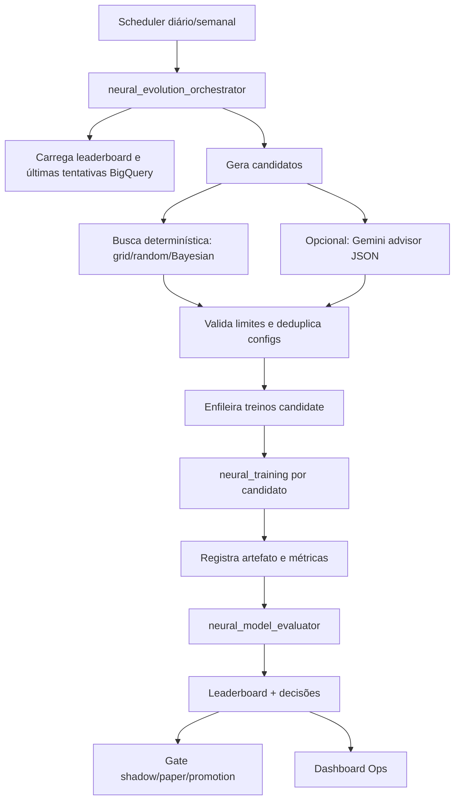

# Plano — Evolução automática inteligente de redes neurais EOD

## Objetivo

Criar um fluxo automático, auditável e seguro para buscar melhores parâmetros e estruturas de rede para o modelo neural EOD, sem depender de execuções manuais isoladas. O fluxo deve explorar candidatos, treinar, validar fora da amostra, comparar contra critérios de governança e promover apenas modelos com evidência robusta.

## Problema atual

Os primeiros treinos registrados provaram que o pipeline consegue gerar artefato e registrar execução, mas ainda não existe um ciclo automático de evolução. Isso deixa três riscos:

1. **Busca manual limitada**: o operador precisa escolher arquitetura e hiperparâmetros manualmente.
2. **Pouca evidência comparativa**: não há ranking padronizado de candidatos por validação, teste, robustez e custo.
3. **Sem aprendizado de tentativas anteriores**: cada treino não alimenta automaticamente uma política de exploração/exploração (`explore/exploit`).

## Princípios de desenho

- **Sem promoção automática para capital real**: o fluxo pode sugerir e treinar candidatos, mas promoção para shadow/paper/approved continua passando pelos gates existentes.
- **Avaliação fora da amostra obrigatória**: nenhum candidato pode ser classificado como vencedor sem métricas em `validation` e `test`.
- **Rastreabilidade completa**: toda sugestão, treino, métrica, decisão e justificativa deve ser persistida em BigQuery.
- **Orçamento controlado**: limitar quantidade de tentativas por janela, custo estimado, tempo máximo e complexidade de rede.
- **Reprodutibilidade**: cada candidato deve salvar `candidate_config_json`, `random_seed`, snapshot de dataset, versão de features/labels e artefato.
- **IA como avaliadora consultiva, não executora soberana**: Gemini pode recomendar novas configurações a partir de métricas e histórico, mas o sistema valida schema, limites e gates antes de executar.

## Arquitetura proposta



## Componentes novos

### 1. `neural_evolution_orchestrator`

Cloud Function ou Cloud Run Job responsável por:

- Ler o snapshot de treino mais recente com splits válidos.
- Consultar histórico de candidatos, métricas e custos.
- Definir orçamento da rodada (`max_trials`, `max_runtime_minutes`, `max_parameter_count`, `max_layers`).
- Gerar uma lista de candidatos.
- Enfileirar chamadas para `neural_training` com `model_version` único e `candidate_config_json`.

### 2. `neural_candidate_generator`

Módulo Python com duas estratégias:

- **Determinística inicial**:
  - random search controlado;
  - pequenas grades para `hidden_units`, `dropout_rate`, `learning_rate`, `batch_size`, `epochs`, `class_weight`, threshold direcional e versões de features;
  - mutação dos melhores candidatos anteriores.
- **IA consultiva opcional**:
  - envia histórico resumido e restrito ao modelo Gemini;
  - recebe JSON com novas configurações propostas;
  - valida tudo contra schema e limites antes de treinar.

### 3. `neural_model_evaluator`

Processo que consolida métricas de cada candidato:

- `train`, `validation`, `test` accuracy;
- precisão direcional e cobertura por split;
- matriz de confusão;
- estabilidade entre validação e teste;
- degradação fora da amostra;
- quantidade de sinais úteis estimados;
- custo/tempo de treino;
- score final ponderado.

### 4. Leaderboard e auditoria

Criar tabelas BigQuery:

#### `neural_evolution_runs`

Uma linha por rodada de evolução.

Campos sugeridos:

- `evolution_run_id`
- `started_at`, `finished_at`
- `dataset_snapshot`
- `feature_version`, `label_version`
- `strategy` (`random_search`, `bayesian`, `gemini_advisor`, `hybrid`)
- `budget_json`
- `status`
- `summary_json`

#### `neural_candidate_configs`

Uma linha por candidato sugerido.

Campos sugeridos:

- `candidate_id`
- `evolution_run_id`
- `model_id`, `model_version`
- `candidate_source` (`deterministic`, `gemini`, `mutation`)
- `architecture_json`
- `hyperparameters_json`
- `training_request_json`
- `schema_validation_status`
- `dedupe_hash`
- `created_at`

#### `neural_candidate_evaluations`

Uma linha por avaliação final de candidato.

Campos sugeridos:

- `candidate_id`
- `model_version`
- `dataset_snapshot`
- `metrics_json`
- `score_total`
- `score_directional_precision`
- `score_coverage`
- `score_generalization`
- `score_stability`
- `score_cost_penalty`
- `decision` (`reject`, `keep_candidate`, `shadow_candidate`, `paper_candidate`)
- `decision_reasons_json`
- `created_at`

## Espaço inicial de busca

### Hiperparâmetros

- `hidden_units`: `[32]`, `[64,32]`, `[128,64]`, `[128,64,32]`, `[256,128,64]`
- `dropout_rate`: `0.0`, `0.10`, `0.15`, `0.25`, `0.35`
- `learning_rate`: `0.0003`, `0.0005`, `0.001`, `0.002`
- `batch_size`: `128`, `256`, `512`
- `epochs`: `20`, `40`, `80`, com early stopping obrigatório
- `class_weight`: sem peso, balanceado por frequência, penalização maior para `up/down`
- `random_seed`: múltiplas sementes para finalistas

### Estruturas de rede

Começar simples e evoluir com controle:

1. **MLP baseline**: densa simples, já existente.
2. **MLP com batch normalization**: estabiliza treino em features tabulares.
3. **MLP residual curta**: blocos pequenos para reduzir degradação em redes mais profundas.
4. **Wide & Deep tabular**: combina features cruas normalizadas com camadas densas.
5. **Ensemble leve**: média de 3 sementes dos melhores candidatos, apenas se custo permitir.

Fora do primeiro ciclo, avaliar redes sequenciais apenas se houver features temporais explícitas por janela, porque o dataset atual é tabular EOD por linha.

## Score de seleção proposto

O score final deve evitar escolher modelo que só melhora treino.

```text
score_total =
  0.30 * directional_precision_test
+ 0.20 * directional_precision_validation
+ 0.15 * coverage_test
+ 0.15 * accuracy_test
+ 0.10 * stability_score
+ 0.10 * risk_adjusted_backtest_score
- 0.10 * overfit_penalty
- 0.05 * complexity_penalty
```

Regras duras antes do score:

- rejeitar se `test` ausente;
- rejeitar se `coverage_test` abaixo do mínimo operacional;
- rejeitar se `directional_precision_test` não superar baseline heurístico;
- rejeitar se diferença `train - test` indicar overfit severo;
- rejeitar se número de amostras por classe em `test` for insuficiente.

## Uso opcional de Gemini como avaliador/sugeridor

Gemini pode ser usado como **advisor** para propor a próxima rodada de candidatos, não para promover modelos diretamente.

### Entradas para o Gemini

Enviar apenas resumo estruturado:

- top N candidatos e métricas por split;
- candidatos rejeitados e motivos;
- espaço de busca permitido;
- orçamento da próxima rodada;
- restrições de risco;
- distribuição de labels e alvos/stops;
- métricas de overfit/generalização.

### Saída esperada

Usar resposta JSON validada por schema, por exemplo:

```json
{
  "rationale": "explorar dropout menor nos modelos com boa cobertura e reduzir learning_rate nos candidatos instáveis",
  "candidates": [
    {
      "architecture": {"type": "mlp", "hidden_units": [128, 64], "batch_norm": true},
      "hyperparameters": {"dropout_rate": 0.10, "learning_rate": 0.0005, "batch_size": 256, "epochs": 60},
      "risk_notes": ["validar degradação train-test"]
    }
  ]
}
```

### Guardrails obrigatórios

- Validar JSON contra schema local.
- Recusar parâmetros fora do orçamento.
- Deduplicar candidatos já testados.
- Nunca executar código retornado pela IA.
- Nunca enviar credenciais, PII, chaves ou dados brutos sensíveis.
- Persistir prompt resumido, resposta, versão do modelo Gemini e validação em BigQuery.

### Base técnica Gemini

A documentação oficial do Gemini descreve **function calling** para conectar o modelo a ferramentas/APIs com argumentos estruturados e **structured output** para respostas JSON aderentes a schema. Essas capacidades são adequadas para um advisor que retorna apenas configurações candidatas validadas pelo nosso sistema, sem executar ações críticas diretamente.

Referências oficiais consultadas em 2026-06-20:

- Gemini API — Function calling: <https://ai.google.dev/gemini-api/docs/function-calling>
- Gemini API — Structured output: <https://ai.google.dev/gemini-api/docs/structured-output>
- Google Cloud — Function calling e structured output no Gemini Enterprise Agent Platform: <https://docs.cloud.google.com/gemini-enterprise-agent-platform/models/tools/function-calling>

## Fluxo operacional por fases

### Fase 0 — Pré-requisito obrigatório

- Garantir dataset com `train`, `validation` e `test` preenchidos.
- Reexecutar materialização após correção de splits.
- Reexecutar baseline atual para criar referência comparável.

### Fase 1 — Evolução determinística sem IA

- Criar tabelas de evolução.
- Implementar gerador random/grid limitado.
- Rodar 10 a 20 candidatos por rodada.
- Registrar leaderboard.
- Exibir ranking no Ops.

### Fase 2 — Otimização guiada por histórico

- Mutar top 20% dos candidatos.
- Penalizar arquiteturas instáveis/caras.
- Repetir finalistas com múltiplas seeds.
- Adicionar early stopping e class weights.

### Fase 3 — Advisor Gemini opcional

- Implementar módulo `neural_ai_advisor` isolado.
- Usar somente JSON estruturado.
- Registrar prompt/resposta/auditoria.
- Comparar sugestões Gemini contra random/mutation em A/B operacional.

### Fase 4 — Governança e promoção

- Integrar vencedores ao gate de shadow.
- Só promover para paper trading após janela mínima e critérios existentes.
- Criar alertas para overfit, queda de cobertura e drift de labels.

## Interfaces sugeridas no Ops

Adicionar abas/cards:

- **Evolução neural**: última rodada, orçamento, candidatos gerados, status.
- **Leaderboard**: score total, validação, teste, cobertura, precisão direcional, custo, decisão.
- **Comparação com baseline**: ganho/perda vs modelo anterior e heurística.
- **Advisor IA**: recomendações, schema validation, candidatos aceitos/rejeitados.
- **Riscos**: overfit, baixa cobertura, instabilidade entre seeds, classes desbalanceadas.

## Critérios de aceite para começar implementação

1. Existe snapshot com splits `train`, `validation` e `test`.
2. `neural_training` aceita configuração completa de arquitetura/hiperparâmetros.
3. Métricas por split são persistidas em `metrics_json`.
4. Tabelas de evolução foram criadas.
5. Um scheduler consegue iniciar uma rodada com orçamento limitado.
6. A UI mostra leaderboard e motivos de rejeição.
7. Advisor IA, se habilitado, é opcional e não bloqueia o fluxo determinístico.

## Próximo passo recomendado

Implementar primeiro a **Fase 1 determinística**. Ela entrega valor imediatamente, reduz dependência manual e cria histórico suficiente para que um advisor Gemini seja útil depois. A integração com Gemini deve entrar apenas quando já houver leaderboard confiável e critérios automáticos de rejeição funcionando.
