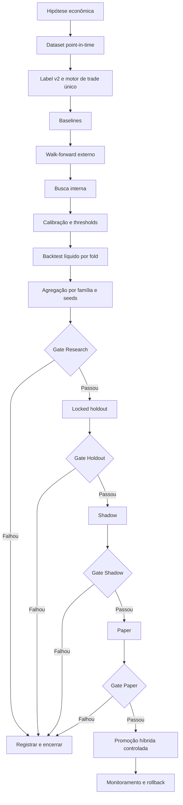
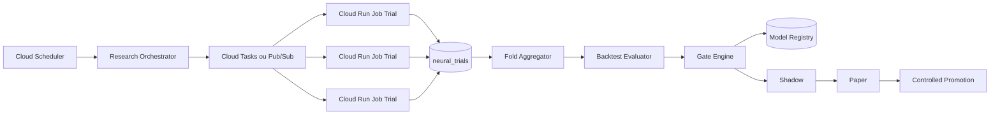

# Método Unificado de Evolução Neural do SisAção — MUEN v1

**Status:** proposta de fonte normativa para pesquisa, validação e promoção de modelos neurais EOD  
**Escopo inicial:** sinais EOD tabulares `down / neutral / up`  
**Plano de experiência e telas:** [plano-telas-evolucao-neural.md](./plano-telas-evolucao-neural.md)

> Nenhum modelo avança por acurácia, complexidade ou `score_total` isolado. Ele precisa demonstrar utilidade econômica líquida, robustez temporal e segurança operacional.

Este método não promete lucro. Seu objetivo é reduzir vazamento temporal, sobreajuste de backtest, escolhas oportunistas e promoções prematuras.

---

## 1. Papel dos documentos existentes

Este documento passa a ser a referência normativa. Os demais documentos continuam úteis como apoio:

| Documento | Papel |
|---|---|
| `plano-evolucao-redes-neurais-mercado-financeiro.md` | Referência conceitual ampla |
| `evolucao-neural-automatica.md` | Automação e implementação |
| `diagnostico-evolucao-redes-neurais-eod.md` | Runbook operacional |
| **Este documento** | Protocolo, regras obrigatórias e gates |

Toda mudança de label, feature, split, custo, universo, arquitetura, métrica ou gate deve gerar nova `protocol_version`.

---

## 2. Diagnóstico consolidado

O projeto já possui uma boa fundação: dataset EOD versionado, MLP reproduzível, scaler ajustado no treino, splits cronológicos com embargo, registro de artefatos, geração de candidatos, mutações, repetição por seeds, leaderboard, inferência, shadow, paper e promoção controlada.

Antes de ampliar arquiteturas ou aumentar a frequência de mutações, os seguintes pontos precisam ser corrigidos.

### 2.1 Label incompatível com o trade de 15 pregões

Em `sisacao8/neural_dataset.py`, após a entrada ser tocada, se target e stop não forem atingidos no mesmo candle, `_evaluate_side` encerra o resultado pelo fechamento daquele candle. Isso não representa uma posição que permanece aberta até target, stop ou expiração.

Consequências:

- o alvo supervisionado diverge da operação descrita;
- `days_to_event` deixa de refletir a vida real do trade;
- label e backtest podem avaliar negócios diferentes;
- tuning de rede passa a otimizar um problema incorreto.

**Decisão:** criar `label_eod_barrier_v2` com um motor de trade stateful compartilhado por labels, backtest, paper e produção.

### 2.2 O conjunto chamado de `test` participa do tuning

O score atual usa métricas de `test`. A Fase 2 lê o leaderboard, escolhe os melhores pais e gera mutações. Depois de várias rodadas, o `test` influencia a pesquisa e deixa de ser um teste final independente.

**Decisão:** separar:

1. validação interna para early stopping e HPO;
2. folds externos walk-forward para pesquisa;
3. holdout final bloqueado;
4. shadow e paper prospectivos.

### 2.3 Seleção ainda majoritariamente classificatória

O score atual combina precisão direcional, cobertura, acurácia, estabilidade e complexidade. O método deve priorizar resultado econômico líquido contra o champion, após custos, e usar métricas classificatórias como diagnóstico.

### 2.4 Threshold fixo e probabilidades sem calibração

A inferência usa limiar padrão de `0.60`. O threshold correto depende de custos, classe, regime, calibração e utilidade econômica.

**Decisão:** calibrar probabilidades em janela exclusiva e otimizar `threshold_buy` e `threshold_sell` separadamente, sem consultar outer test ou holdout.

### 2.5 Orquestração síncrona

O orquestrador chama cada treino por HTTP e aguarda sequencialmente. Esse desenho é frágil para folds, seeds, retries, paralelismo, cancelamento e retomada.

**Decisão:** a unidade de execução será `candidato × fold × seed`, processada por Cloud Run Job ou fila de tarefas, com idempotência e estado persistido.

### 2.6 Gates existem, mas não formam uma cadeia única

Há helpers de shadow, paper e promoção, mas o ciclo de pesquisa ainda não executa uma máquina de estados end-to-end.

**Decisão:** criar uma `gate_engine` única. Leaderboard ordena; gate decide.

### 2.7 Duplicação do pacote `sisacao8`

O código aparece na raiz e dentro de Functions. O diário já registra falha de deploy por divergência entre cópias.

**Decisão:** publicar pacote único ou imagem compartilhada. Durante a migração, CI deve comparar hashes das cópias.

### 2.8 Ajustes adicionais

- `estimate_parameter_count` assume 18 features, enquanto o treino atual usa 19;
- `batch_norm` aparece em configuração, mas não é aplicado pelo builder;
- parâmetros ignorados devem gerar erro de schema;
- OHLCV nominal bruto deve ser justificado ou transformado;
- seeds não devem competir como modelos independentes;
- executar mutações contínuas antes de corrigir o protocolo acelera sobreajuste.

---

## 3. Definição de sucesso

Um modelo é bem-sucedido somente quando satisfaz simultaneamente:

1. nenhuma feature, transformação, universo ou label usa futuro;
2. supera champion e baselines depois de custos;
3. mantém ganho em múltiplos folds;
4. funciona com regras reais de entrada, gaps, liquidez e short;
5. mantém desempenho em várias seeds;
6. passa um holdout bloqueado sem ajustes posteriores;
7. confirma comportamento em shadow e paper;
8. possui promoção explícita, auditável e reversível.

“Melhor rede” é a candidata mais simples que entrega vantagem líquida e estável.

---

## 4. Vocabulário oficial

| Termo | Definição |
|---|---|
| `champion` | Estratégia ou modelo aprovado como referência |
| `challenger` | Candidato que compete com o champion |
| `candidate family` | Arquitetura e hiperparâmetros relevantes, ignorando seed |
| `trial` | Um treino de uma configuração em um fold e seed |
| `research OOS` | Folds externos usados durante pesquisa |
| `locked holdout` | Período final invisível ao tuning |
| `shadow` | Inferência ao vivo sem ordens |
| `paper` | Simulação operacional ao vivo sem capital |
| `protocol_version` | Contrato imutável de dados, validação, custos e gates |
| `decision policy` | Calibração, thresholds, ranking e filtros que transformam probabilidades em sinais |

---

## 5. Fluxo unificado



---

## 6. Fase 0 — Hipótese econômica

**Execução registrada:** [Fase 0 — Hipótese econômica MUEN v1](../implementacao/fase0-muen-hipotese-economica.md).

Nenhuma rodada começa apenas com “testar rede maior”. Cada protocolo declara:

- padrão de mercado pretendido;
- universo point-in-time;
- instante da decisão;
- horizonte;
- lados BUY/SELL;
- entrada e saída;
- capacidade operacional;
- custos;
- baseline equivalente;
- motivo para usar rede neural.

Exemplo:

> Usando somente dados disponíveis no fechamento de D, estimar ativos com vantagem líquida para ordem limitada a partir de D+1, com entrada de 2%, target/stop versionados e horizonte máximo de 15 pregões.

---

## 7. Fase 1 — Label e motor de execução únicos

**Execução registrada:** [Fase 1 — Label e motor de execução únicos](../implementacao/fase1-muen-label-motor-execucao.md).

Labels, backtest, paper e avaliação operacional devem usar o mesmo motor de estado.

```text
PENDING_ENTRY
  -> OPEN, quando a entrada é executável
  -> EXPIRED_UNFILLED

OPEN
  -> TARGET
  -> STOP
  -> EXPIRED_MARK_TO_MARKET
  -> INVALID
```

### Regras do `label_eod_barrier_v2`

1. calcular entrada, target e stop a partir do fechamento de D;
2. procurar entrada somente a partir de D+1;
3. após fill, manter posição até target, stop ou expiração;
4. descontar custos, spread, slippage e aluguel quando aplicável;
5. tratar gaps com preço executável;
6. registrar cada transição;
7. resolver target e stop no mesmo candle com intraday ou política conservadora versionada;
8. marcar a mercado no fim do horizonte;
9. distinguir não entrou, expirou, target, stop e dado inválido.

### Saídas

- `label_class`;
- `trade_side`;
- `entry_filled`;
- `entry_date`, `entry_price`;
- `exit_date`, `exit_price`, `exit_reason`;
- `gross_return`, `net_return`;
- `holding_sessions`;
- `max_adverse_excursion`;
- `max_favorable_excursion`;
- `execution_policy_version`.

### Testes obrigatórios

Cobrir entrada não tocada, target/stop posterior, ambiguidades no mesmo candle, gaps, expiração, dados ausentes, BUY/SELL, feriados e paridade label/backtest.

`label_eod_barrier_v1` permanece somente para auditoria.

---

## 8. Fase 2 — Dataset point-in-time

**Execução registrada:** [Fase 2 — Dataset point-in-time](../implementacao/fase2-muen-dataset-point-in-time.md).


Cada snapshot registra:

- snapshot, protocolo, feature e label version;
- hash da query/código e commit Git;
- período e universo;
- calendário e corporate actions;
- política de sobrevivência/delistagem;
- distribuição de labels;
- qualidade por ativo/data;
- custos assumidos.

### Controles contra leakage

- scaler, imputação e seleção de features somente no treino;
- nenhuma estatística global;
- purge de labels que atravessam fronteiras;
- embargo de pelo menos o horizonte máximo;
- universo reconstruído como existia na data;
- decisão em D sem usar D+1.

### Features iniciais

Priorizar log-retornos, retorno relativo, volatilidade, range normalizado, gap, volume em log, volume relativo, distâncias técnicas, liquidez, regime, beta/correlação passados e flags de qualidade.

Reavaliar OHLCV nominal bruto.

---

## 9. Fase 3 — Protocolo temporal

Usar nested walk-forward:

```text
Histórico de pesquisa
  Fold 1: train -> validation/calibration -> outer test
  Fold 2: train expandido -> validation/calibration -> outer test
  ...

Locked holdout
  período mais recente isolado

Depois
  shadow -> paper -> operação controlada
```

### Configuração inicial sugerida

```yaml
min_train_sessions: 504
outer_folds: 5
outer_test_sessions: 63
calibration_sessions: 42
embargo_sessions: 15
locked_holdout_sessions: 126
split_mode: expanding_walk_forward
```

O gerador de candidatos, Gemini, HPO e leaderboard não podem consultar métricas, predições ou trades do holdout.

Após abrir o holdout, qualquer alteração de feature, label, arquitetura, threshold, custo ou decisão invalida o resultado.

---

## 10. Baselines obrigatórios

Todo challenger compete com:

1. sempre neutral/não operar;
2. frequência aleatória equivalente;
3. heurística atual;
4. regressão logística;
5. árvore/gradient boosting tabular;
6. MLP simples.

A comparação principal é contra o champion operacional vigente.

---

## 11. Famílias de modelos

Prioridade:

1. regressão logística;
2. gradient boosting tabular;
3. MLP simples;
4. MLP com regularização e batch normalization;
5. MLP residual curta;
6. ensemble realmente diverso;
7. TCN/GRU somente com dataset sequencial;
8. Transformer temporal pequeno somente com dados suficientes.

Modelos sequenciais exigem contrato `[amostras, passos, features]`, máscara, timestamps e normalização sem futuro.

---

## 12. Busca de hiperparâmetros

Usar exploração ampla com random/TPE e confirmação restrita dos melhores. Early stopping e pruning encerram tentativas fracas.

```text
trial_id = protocol + snapshot + family_hash + fold + seed
```

Cada trial é idempotente.

Primeiro buscar apenas parâmetros implementados: `hidden_units`, `dropout_rate`, `learning_rate`, `batch_size`, `class_weight`, `epochs` como teto e `random_seed`.

Depois de ampliar o builder: `weight_decay`, batch normalization, ativação, label smoothing, residual e scheduler.

Top famílias devem ser repetidas em 3 a 5 seeds.

### Gemini

Pode sugerir hipóteses e regiões do espaço, mas não pode ler holdout, executar código, alterar gates ou decidir promoção. Seu valor deve ser medido em A/B contra o gerador determinístico.

---

## 13. Calibração e política de decisão

Separar o artefato neural da policy que decide BUY, SELL, HOLD, ranking, quantidade de sinais e sizing.

Aplicar calibração em janela exclusiva e registrar Brier score, log loss e erro de calibração.

Otimizar separadamente:

- `threshold_buy`;
- `threshold_sell`;
- margem contra neutral;
- diferença mínima entre `prob_up` e `prob_down`.

Objetivo:

```text
maximizar utilidade líquida
sujeito a cobertura, trades, drawdown, liquidez e custo
```

Nunca otimizar threshold no outer test ou holdout.

---

## 14. Backtest econômico único

Simular preço executável, entrada limitada, target, stop, expiração, gaps, spread, slippage, taxas, aluguel, liquidez, limites de posição/setor, sinais máximos e capital ocupado.

Avaliar custo base, 1,5× e 2×.

### Métricas primárias

- retorno e expectativa líquidos;
- profit factor;
- Sharpe/Sortino quando aplicável;
- drawdown;
- turnover e exposição;
- fill rate e trades;
- payoff;
- pior mês e pior fold;
- concentração;
- sensibilidade a custos;
- diferença contra champion.

Métricas classificatórias continuam diagnósticas, mas não autorizam promoção.

---

## 15. Agregação por família

Sementes não aparecem como vencedores independentes. Para cada `candidate_family_hash`, agregar:

- mediana, média e dispersão;
- intervalo de confiança;
- pior fold;
- proporção de folds positivos;
- estabilidade entre seeds;
- correlação com champion;
- custo e complexidade.

Família instável é rejeitada mesmo que uma seed isolada seja excelente.

---

## 16. Seleção: gates antes de score

Procedimento:

1. aplicar hard gates;
2. construir fronteira de Pareto entre retorno, drawdown, robustez e complexidade;
3. ordenar aprovados;
4. usar simplicidade como desempate;
5. registrar decisão.

Ordem sugerida:

1. mediana do delta de expectativa líquida vs champion;
2. proporção de folds com ganho;
3. pior fold;
4. drawdown;
5. custo;
6. calibração;
7. complexidade.

`rank_score` pode existir apenas para UI, com aviso de que não representa aprovação.

---

## 17. Gates oficiais

### Gate 0 — Dados e labels

Label v2, invariantes, splits, purge, embargo, qualidade, amostra e snapshot imutável.

### Gate 1 — Sanidade

Treino concluído, probabilidades válidas, artefato reproduzível, parâmetros aplicados e ausência de leakage.

### Gate 2 — Research walk-forward

Resultado líquido mediano superior ao champion, ganho em pelo menos 4/5 folds, trades suficientes, ausência de fold catastrófico, drawdown aceitável, custo 1,5× e estabilidade entre seeds.

### Gate 3 — Locked holdout

Executado uma única vez após congelar tudo. Exige ganho líquido, amostra, drawdown, custo 2× e coerência com os folds.

### Gate 4 — Shadow

Previsões completas, contrato compatível, latência, disponibilidade, drift e divergência controlados.

### Gate 5 — Paper

Janela e trades mínimos, profit factor, drawdown, fill rate, custos, divergência e ausência de violações.

### Gate 6 — Promoção

Aprovação humana, modo `hybrid`, fallback `heuristic`, exposição pequena, kill switch e rollback.

### Gate 7 — Continuidade

Pausar ou aposentar por drawdown, perda de vantagem, drift, degradação, falha de dados/inferência ou modelo simples equivalente.

---

## 18. Champion–challenger

Todo retreino compete com champion, heurística, baseline não neural e versão anterior da família. Não promover por melhoria pequena: exigir ganho material ou redução de risco.

---

## 19. Arquitetura GCP recomendada



Estados:

```text
planned, queued, running, trained, evaluated, rejected, selected,
holdout_pending, holdout_passed, shadow, paper, approved, active,
paused, retired, failed, cancelled
```

Chave de idempotência:

```text
(protocol_version, dataset_snapshot, candidate_family_hash, fold_id, seed, code_commit)
```

---

## 20. Modelo de dados

Adicionar, preservando tabelas atuais:

- `neural_protocols`;
- `neural_dataset_manifests`;
- `neural_trials`;
- `neural_fold_metrics`;
- `neural_daily_returns`;
- `neural_family_evaluations`;
- `neural_gate_decisions`.

`neural_daily_returns` é necessária para comparação pareada, intervalos e controle de múltiplos testes.

---

## 21. Contrato inicial

```json
{
  "protocol_version": "neural_eod_protocol_v1",
  "hypothesis_id": "eod_barrier_direction_v2",
  "dataset": {
    "feature_version": "feature_eod_tabular_v2",
    "label_version": "label_eod_barrier_v2",
    "universe_version": "b3_point_in_time_v1"
  },
  "execution": {
    "entry_pct": 0.02,
    "target_pct": 0.07,
    "stop_pct": 0.07,
    "horizon_sessions": 15,
    "same_bar_policy": "conservative_stop_first",
    "cost_scenarios": [1.0, 1.5, 2.0]
  },
  "validation": {
    "mode": "nested_expanding_walk_forward",
    "outer_folds": 5,
    "outer_test_sessions": 63,
    "calibration_sessions": 42,
    "embargo_sessions": 15,
    "locked_holdout_sessions": 126
  },
  "selection": {
    "primary_metric": "median_delta_net_expectancy_vs_champion",
    "minimum_positive_folds": 4,
    "seed_repeats": 3,
    "score_is_promotional": false
  },
  "promotion": {
    "requires_explicit_approval": true,
    "initial_signal_source": "hybrid",
    "fallback_signal_source": "heuristic"
  }
}
```

---

## 22. Roadmap técnico

1. corrigir label e criar motor de trade comum;
2. implementar walk-forward, purge e holdout;
3. criar baselines e avaliador econômico;
4. avaliar por família, folds e seeds;
5. retirar o test estático do tuning;
6. executar trials assíncronos e idempotentes;
7. calibrar probabilidades e thresholds;
8. integrar gates ao runtime;
9. implementar UI champion–challenger e jornada;
10. ativar advisor opcional somente depois do protocolo determinístico.

---

## 23. Critérios de aceite

O MUEN v1 estará implementado quando:

- label e backtest usam o mesmo motor;
- existe `label_eod_barrier_v2` testado;
- existem folds externos e holdout bloqueado;
- HPO não consulta holdout;
- normalização é fitada no treino;
- candidatos competem com champion e baselines;
- métricas financeiras líquidas existem por fold;
- daily returns são persistidos;
- candidatos são agregados por família;
- top famílias são repetidas por seeds;
- score não promove;
- gates são executados no runtime;
- treinamento é assíncrono e idempotente;
- artefato, dataset, código e policy são reproduzíveis;
- shadow e paper precedem promoção;
- promoção exige aprovação e mantém fallback.

---

## 24. O que não fazer agora

- aumentar mutações sobre o mesmo `test`;
- interpretar mais redes “mantidas” como progresso;
- adotar LSTM/Transformer antes do dataset sequencial;
- promover por `score_total`;
- escolher arquitetura por acurácia;
- otimizar threshold no test;
- liberar capital automaticamente;
- aceitar parâmetros ignorados;
- executar dezenas de candidatos em chamada síncrona;
- tratar uma seed excepcional como família robusta;
- usar Gemini como autoridade de promoção.

---

## 25. Primeiro ciclo recomendado

1. congelar promoções do protocolo atual;
2. corrigir label e motor de trade;
3. materializar snapshot v2;
4. implementar walk-forward e holdout;
5. rodar baselines;
6. treinar MLP simples;
7. comparar famílias nos folds;
8. calibrar top famílias;
9. confirmar por seeds;
10. congelar protocolo;
11. abrir holdout uma vez;
12. mover vencedor para shadow;
13. executar paper;
14. promover de forma híbrida somente após gates.

A primeira vitória não é encontrar uma rede campeã. É rejeitar com confiança redes que parecem boas por acaso.
